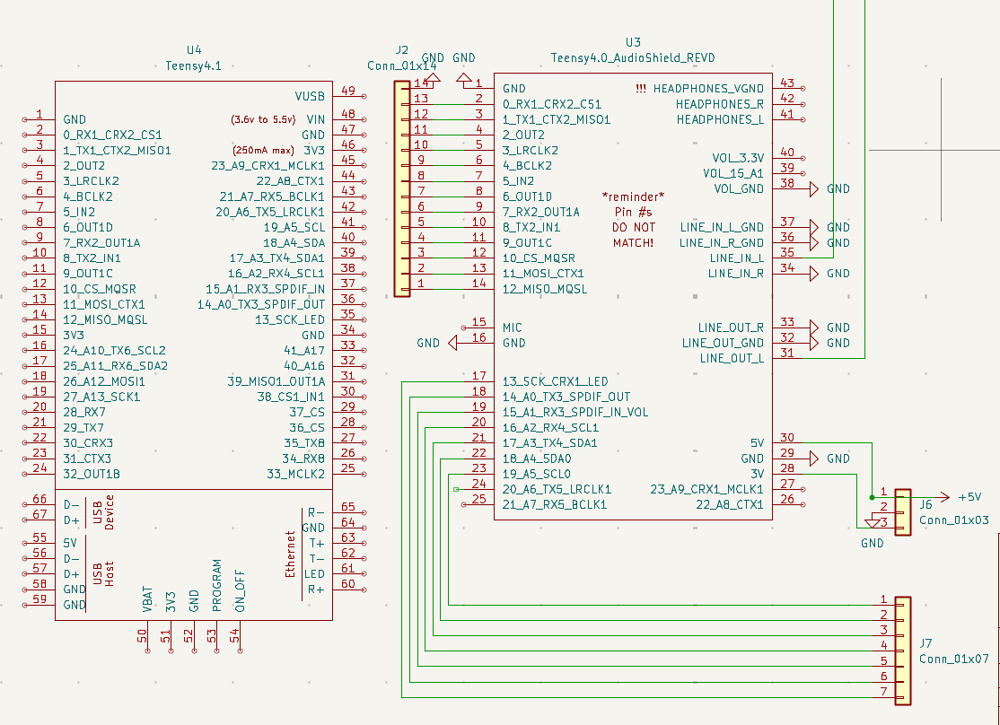
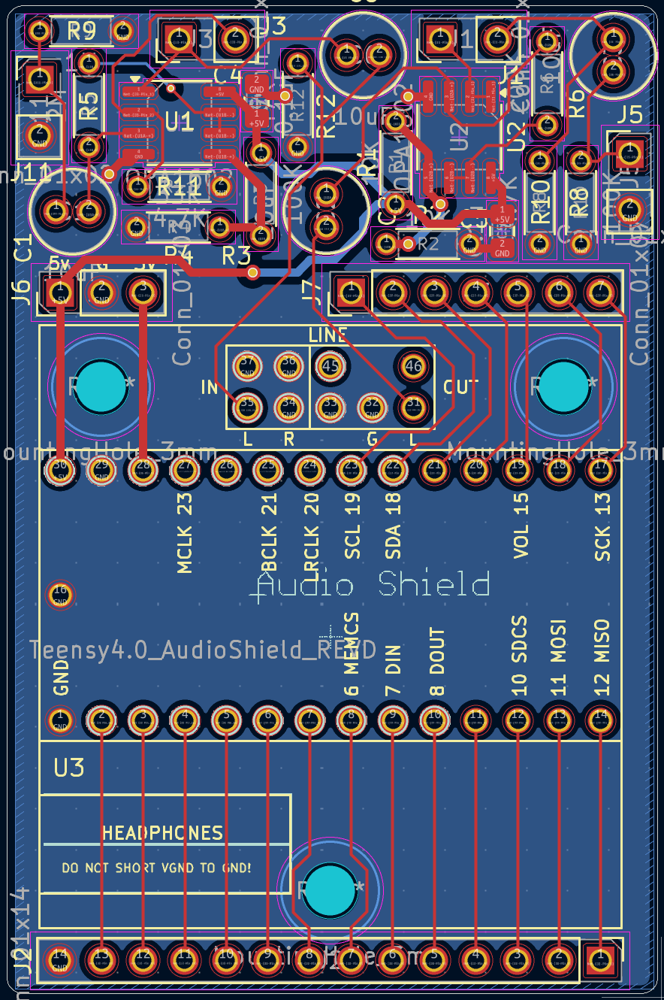
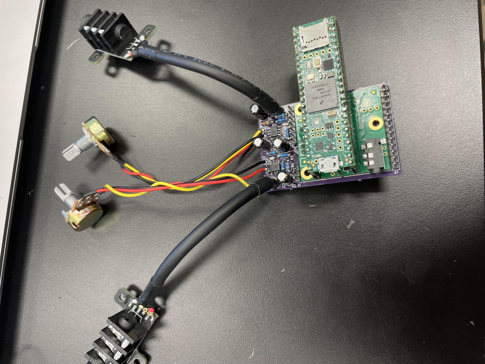

Audio Processor
My project is a custom stompbox that can be used for electric guitar or other instruments like keyboards or even microphones. The circuit digitally processes the signal through software, and can implement many custom audio effects that would be expensive to purchase in the form of guitar pedals or something similar. I ran into a lot of issues building it, but in the end all the hardware works properly and the unit is functional

| **Engineer** | **School** | **Area of Interest** | **Grade** |
|:--:|:--:|:--:|:--:|
| Evan C | Menlo Atherton | Robotics | Incoming Junior


  
# Final Milestone

**Don't forget to replace the text below with the embedding for your milestone video. Go to Youtube, click Share -> Embed, and copy and paste the code to replace what's below.**

<iframe width="560" height="315" src="https://www.youtube.com/embed/QEc9sVze8mI?si=wjUMuKTjMZpzzNMy" title="YouTube video player" frameborder="0" allow="accelerometer; autoplay; clipboard-write; encrypted-media; gyroscope; picture-in-picture; web-share" allowfullscreen></iframe>

For your final milestone, explain the outcome of your project. Key details to include are:
- What you've accomplished since your previous milestone
- What your biggest challenges and triumphs were at BSE
- A summary of key topics you learned about
- What you hope to learn in the future after everything you've learned at BSE


# Second Milestone

<iframe width="560" height="315" src="https://www.youtube.com/embed/QEc9sVze8mI?si=wjUMuKTjMZpzzNMy" title="YouTube video player" frameborder="0" allow="accelerometer; autoplay; clipboard-write; encrypted-media; gyroscope; picture-in-picture; web-share" allowfullscreen></iframe>
In my second milestone, I put together most of the remaining hardware, including making custom perfboards for the 5 potentiometers and splicing together wires from the 3 buttons. This took me a long time because I had an issue with my potentiometer setup. No matter how many times I tried wiring the potentiometers, they never seemed to work when I connected them to the Teensy. After much trial and error and replacing the potentiometers 3 times, I realized that the potentiometers can easily break while being soldered due to poor heat tolerance. This meant that I couldn't easily solder wires to them. Instead, I used a perfboard, where I could use much less solder to connect the potentiometers and thus didn't risk overheating them.

In this stage, I also tested different ways of processing the audio with the Teensy. The Teensy has plenty of processing power, so I was able to chain multiple effects together without latency or memory barriers. I also determined that the circuit works best when the input signal is strong; it requires less gain and thus has less noise after processing and creates a cleaner output.

For my final milestone, I want to finish the electronics; adding an OLED display. I need to write code for this display and figure out how to interface it with the Teensy. Additionally, I need to start writing my main program, which would interface all knobs and buttons with the screen.

# First Milestone

<iframe width="560" height="315" src="https://www.youtube.com/embed/HKZY6D4AcYI" title="YouTube video player" frameborder="0" allow="accelerometer; autoplay; clipboard-write; encrypted-media; gyroscope; picture-in-picture; web-share" allowfullscreen></iframe>

For my first milestone, I setup up basic electronics and wrote some basic code to make sure all the hardware works. The setup tests my custom preamp PCB, the Teensy Audio Shield, and the Teensy microcontroller itself as well as the integration of them all. I've tested the Teensy's ability to read and understand an audio signal, as well as testing basic effects and processing. 

In this basic setup, the audio input is connected to the input jack, which is soldered to my preamp PCB. The PCB uses 2 OPA1602 op-amps to buffer and amplify the signal to make it readable by the Teensy. After the signal is buffered, it is fed into the Teensy Audio Shield, which turns the audio into a digital signal given to the Teensy. The Teensy processes the signal and outputs the signal unmodified in this setup, where it is converted back to an analog signal by the Audio Shield and then buffered and attenuated by my preamp in order to bring the signal back to the same format as the original input.

The biggest challenge in this milestone was integrating all my different components and debugging why the circuit wasn't working. Initially, I connected the Teensy to the Audio Shield incorrectly; I later realized that I needed to initialize the codec chip on the Audio Shield in my code; and the last issue I had was the design tool I was using didn't correctly set up my signal path.

After I fixed all the bugs, I realized that the circuit had a lot of noise, which was especially apparent when the signal was amplified. Moving forward, I need to find where the noise is coming from and implement a noise gate in software if necessary. After I do that, I can move forward with assembling the rest of the electronics.

# Schematics 


 


# Code
This code tests the input and output of the setup; it reads the level of the input, reports it to via the serial port, and outputs the audio unmodified.

```c++
#include <Audio.h>
#include <Wire.h>
#include <SPI.h>
#include <SD.h>
#include <SerialFlash.h>

// GUItool: begin automatically generated code
AudioInputI2S            i2s1;           //xy=257,295
AudioOutputI2S           i2s2;           //xy=415,290
AudioConnection          patchCord1(i2s1, 0, i2s2, 0);

// Add an AudioAnalyzePeak object to measure the input level
AudioAnalyzePeak         peak1;          //xy=400,350

// Connect the left channel of the I2S input to the peak analysis object
AudioConnection          patchCord2(i2s1, 0, peak1, 0); // Connects left channel (0) of i2s1 to peak1
// GUItool: end automatically generated code

//Initialize Audio Shield
AudioControlSGTL5000     sgtl5000_1;     //xy=264,423


void setup() {
  AudioMemory(10); // Allocate memory for audio processing

  // Initialize the audio system
  Audio.begin();

  // Initialize Serial communication for output
  Serial.begin(9600); // You can choose a different baud rate if needed
  Serial.println("Teensy Audio Input Level Monitor");

  // Enable peak detection
  peak1.begin();
}

void loop() {
  // Check if peak analysis has new data available
  if (peak1.available()) {
    // Get the peak value
    float currentPeak = peak1.read();

    // Print the peak value to the serial monitor
    // The peak value is a float from 0.0 to 1.0 (or higher with gain)
    // You might want to scale it or convert it to dB if desired.
    Serial.print("Input Peak Level: ");
    Serial.println(currentPeak, 4); // Print with 4 decimal places for precision
  }

  // Add a small delay to avoid overwhelming the serial monitor
  // Adjust this delay as needed, too short might cause issues, too long will be less responsive
  delay(10);
}
```

# Bill of Materials

| **Part** | **Note** | **Price** | **Link** |
|:--:|:--:|:--:|:--:|
| Teensy 4.1 | Microcontroller | $31.50 | <a href="https://www.sparkfun.com/teensy-4-1.html"> Sparkfun </a> |
| Teensy Audio Shield | Audio input board | $9.80 | <a href="https://www.sparkfun.com/teensy-4-audio-shield-rev-d.html"> Sparkfun </a> |
| 6.35mm Audio Jacks | Connect cables | $9.99 | <a href="https://www.amazon.com/Treedix-Breakout-Pannel-6-35mm-Headphone/dp/B09Z2MQLHX"> Amazon </a> |
| Buttons/Switches | Control effects | $12.49 | <a href="https://www.amazon.com/Etopars-Guitar-Effects-Momentary-Button/dp/B076V2QYSJ"> Amazon </a> |
| Knobs | Control effects | $9.99 | <a href="https://www.amazon.com/EPLZON-Linear-Potentiometer-XH2-54-3-Connector/dp/B0D2991CBF"> Amazon </a> |
| 1.3" OLED | Screen | $10.98 | <a href="https://www.amazon.com/DIYmall-Serial-128X64-Display-Arduino/dp/B06XXTHLNW"> Amazon </a> |

<!--# Other Resources/Examples
One of the best parts about Github is that you can view how other people set up their own work. Here are some past BSE portfolios that are awesome examples. You can view how they set up their portfolio, and you can view their index.md files to understand how they implemented different portfolio components.
- [Example 1](https://trashytuber.github.io/YimingJiaBlueStamp/)
- [Example 2](https://sviatil0.github.io/Sviatoslav_BSE/)
- [Example 3](https://arneshkumar.github.io/arneshbluestamp/)

To watch the BSE tutorial on how to create a portfolio, click here.-->

# Starter Project: Retro Arcade Console

<iframe width="560" height="315" src="https://www.youtube.com/embed/rUmHGdGd8cc?si=I4PNTilWzP2Y3OZt" title="YouTube video player" frameborder="0" allow="accelerometer; autoplay; clipboard-write; encrypted-media; gyroscope; picture-in-picture; web-share" allowfullscreen></iframe>

The Retro Arcade Console is a small handheld console that plays games like Tetris, Snake, and Space Invaders. It can be powered with batteries or plugged in to a USB port. It features an 8x16 LED matrix screen, 6 buttons, and a buzzer for playing sounds and music.

The project was fairly straightforward to build, consisting of a PCB with through-hole components that I soldered on. The most challenging part of the project was soldering smaller parts like the USB power jack, which had very small pins close together that were hard to solder without bridging/shorting pins. The main chip came pre-programmed, so the project was only assembly.

# Schematics:

 

# Bill of Materials:
- **1** Piezo Buzzer
- **1** Electrolytic Capacitor
- **1** Micro USB Jack
- **1** Micro USB Power Cable
- **1** Latching Switch
- **1** Switch Cap
- **1** 3x7 Segment Digitron Display
- **1** Preprogrammed IC Chip
- **2** LED 8x8 Dot Matrices
- **6** Push Buttons
- **6** Button Caps
- **1** PCB
- **8** 3x5mm Screws
- **2** 3x8mm Screws
- **4** Double-pass Copper Standoffs
- **4** Single-head Hexagonal Standoffs
- **1** 3xAAA Battery Case
- **6** Acrylic Panels
