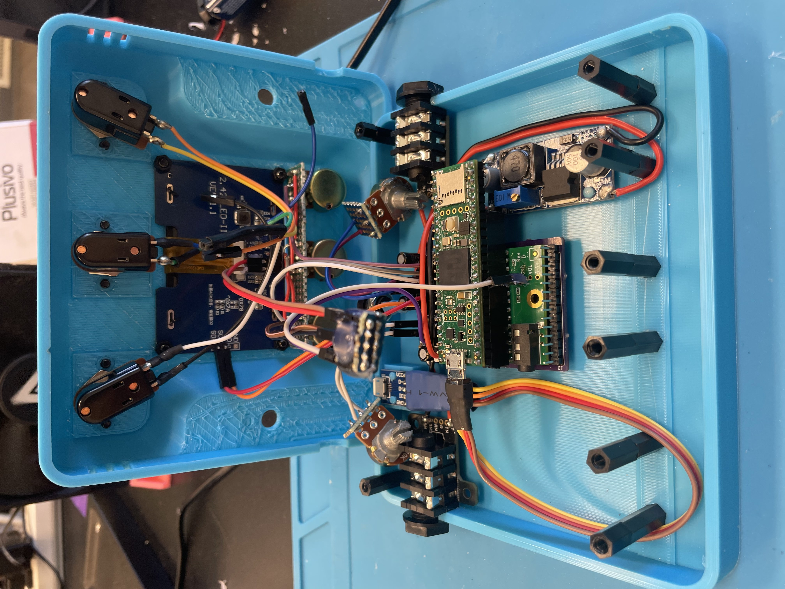
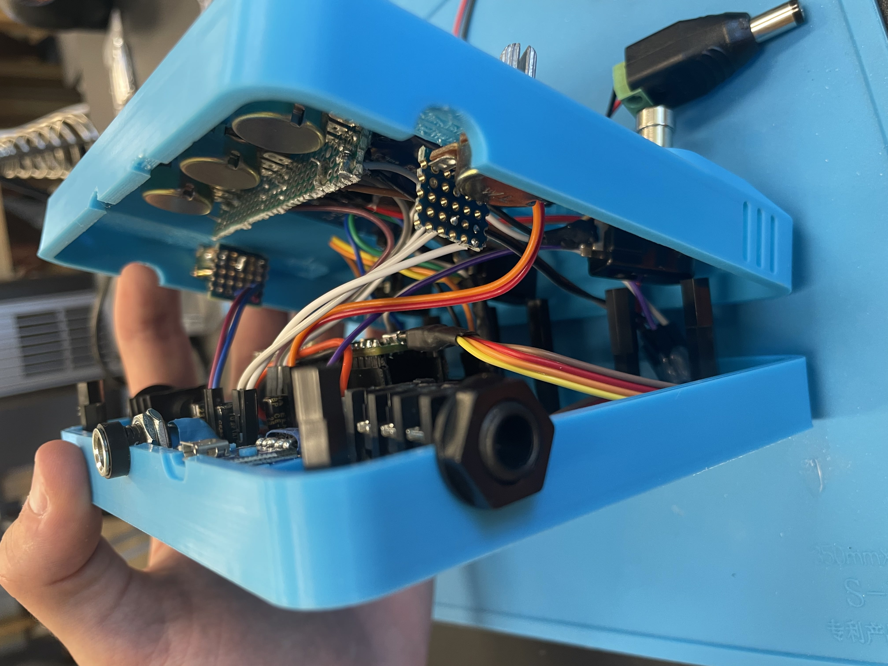
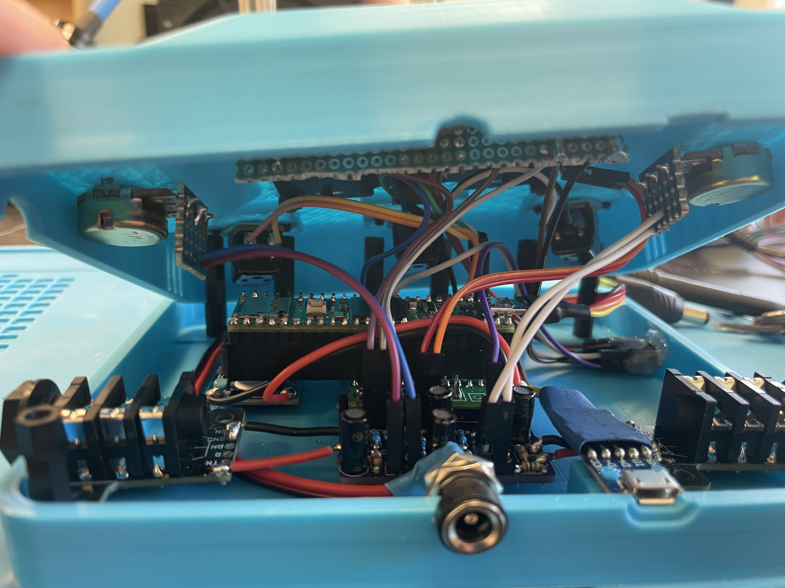
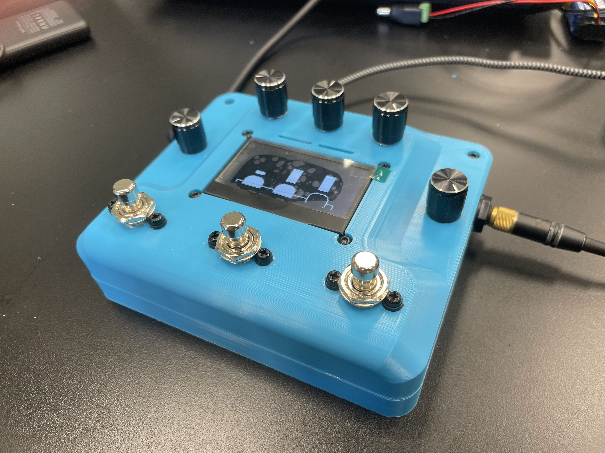
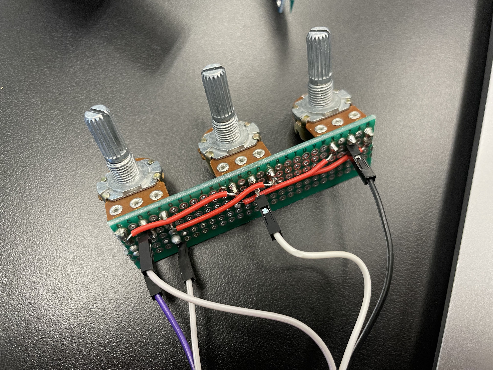

# Stompbox
My project is a custom stompbox that can be used for electric guitar or other instruments like keyboards or even microphones. The circuit digitally processes the signal through software, and can implement many custom audio effects that would be expensive to purchase in the form of guitar pedals or something similar. I ran into a lot of issues building it, both on the hardware and software side, but I fixed them all and the unit is functional.

| **Engineer** | **School** | **Area of Interest** | **Grade** |
|:--:|:--:|:--:|:--:|
| Evan C | Menlo Atherton | Robotics | Incoming Junior


  
# Final Milestone

<iframe width="560" height="315" src="https://youtu.be/oymLfsMuYJ4?si=tYsG7_8uJumdrtFF" title="YouTube video player" frameborder="0" allow="accelerometer; autoplay; clipboard-write; encrypted-media; gyroscope; picture-in-picture; web-share" allowfullscreen></iframe>

### Summary
During my final milestone, I assembled all the hardware in a 3D printed enclosure. The enclosure holds all the parts in place and mounts all the knobs and buttons to the top panel. Additionally, the enclosure has both a 9V barrel jack connector for power and a Micro USB connector for uploading new code. The enclosure uses recessed bolts to mount everything flush to the surface and features vents for cooling as well as metal standoffs for strength. Additionally, I wrote code for other effects like overdrive/distortion during this milestone, which I uploaded to the setup via the Micro USB jack mounted to the enclosure.

Because I didn't want to reprint multiple times, my enclosure had to work the first time with no test fitting. To do this, I took measurements of all the parts inside and thought about factors like 3D printing tolerance and strength. I also considered the pedal layout, placing the footswitches a decent distance apart so multiple wouldn't be pressed at the same time. If I had to do it again, I might change a few parts of the top half of the print, but it works just fine as it is.

### Challenges
The hardest part of this milestone was actually wiring and assembling everything inside the enclosure. Because there wasn't much free space left in the enclosure, I needed to shorten and resolder a lot of the wires. So, it was hard to assemble everything at once because the case needed to be almost closed to make the wires reach. This was only further complicated when I found issues with the OLED display's wiring, which were caused by hot glue seeping into the pins and interrupting the electrical connection. In the end, I managed to connect everything and secure the connections with hot glue, and the pedal works perfectly now.

I also ran into other issues like the display driver not working with the code perfectly. It had a weird issue where all the colums were off by 2 pixels and the only fix was to try to make the screen fill pixels that would ordinarily be off the right side of the screen so that they wrapped around to the left and filled in the missing spots.

Overall, this project taught me a lot about troubleshooting and engineering. Additionally, I learned a lot about audio and electrical engineering when designing my preamp PCB. This project had a lot of hurdles to get over but the end result is well worth it and I'm glad I chose a project that would challenge me.

 
 
 


## Code
```c++
#include <Audio.h>
#include <Wire.h>
#include <SPI.h>
#include <SD.h>
#include <SerialFlash.h>
#include <Bounce2.h>
#include <Arduino.h>
#include <U8g2lib.h>

#ifdef U8X8_HAVE_HW_SPI
#include <SPI.h>
#endif
#ifdef U8X8_HAVE_HW_I2C
#include <Wire.h>
#endif

AudioControlSGTL5000     sgtl5000_1;     //xy=264,423
AudioInputI2S            i2s1;
AudioOutputI2S           i2s2;
AudioMixer4              mixer1;         //xy=353,208
AudioMixer4              mixer2;         //xy=353,208
AudioMixer4              mixer3;         //xy=703,226
AudioAmplifier           amp1;           //xy=450,142
AudioEffectFade          fade1;          //xy=232,190
//AudioEffectChorus        chorus1;        //xy=308,131 // Chorus commented out, ensure buffer is also commented out if not used
AudioEffectWaveshaper    waveshaper1;
AudioEffectDelay         delay1;         //xy=510,206
AudioAnalyzeNoteFrequency notefreq1;      //xy=715,294
AudioSynthKarplusStrong  string1;        //xy=384,494
AudioAnalyzePeak         peak1;          //xy=451,348
AudioAnalyzePeak         peak2;          //xy=451,348

AudioConnection          patchCord1(i2s1, 0, mixer1, 0);
AudioConnection          patchCord9(i2s1, 0, peak1, 0);
AudioConnection          patchCord2(i2s1, 0, notefreq1, 0);
AudioConnection          patchCord3(string1, 0, mixer1, 1);
AudioConnection          patchCord11(mixer1, 0, fade1, 0);
AudioConnection          patchCord5(fade1, 0, amp1, 0);
AudioConnection          patchCord14(amp1, 0, waveshaper1, 0);
AudioConnection          patchCord4(amp1, 0, mixer3, 1);
AudioConnection          patchCord13(waveshaper1, 0, mixer3, 0);
AudioConnection          patchCord12(mixer3, 0, mixer2, 0);
AudioConnection          patchCord6(mixer2, 0, delay1, 0);
AudioConnection          patchCord7(delay1, 0, mixer2, 1);
AudioConnection          patchCord8(mixer2, 0, i2s2, 0);
AudioConnection          patchCord10(mixer2, 0, peak2, 0);

// U8g2 Constructor for SSD1309 128x64 I2C display.
// Using NONAME2 as suggested by the compiler.
U8G2_SSD1309_128X64_NONAME2_F_HW_I2C u8g2(U8G2_R0, /* reset=*/ U8X8_PIN_NONE, 0x3C, &Wire);
const int DISPLAY_X_OFFSET = -2; // Adjust this value if the wrapping is different

// Transient //
double level = 0;
double averageLevel = 0;
double response = 0.1;

double level2 = 0;

// Screen //
long mappedPeak1;
int barHeight1;
long mappedPeak2;
int barHeight2;

long mappedPeak3;
int barHeight3;
long mappedPeak4;
int barHeight4;
long mappedPeak5;
int barHeight5;

bool updated = true;

// Synth //
double freq = 0;
double lastFreq = 0;
double threshold = 0.25;
int lastNote = 0;
int noteDelay = 250;

// Overdrive //
#define WAVESHAPE_LENGTH 257
float myDistortionCurve[WAVESHAPE_LENGTH];

void generateTanhClip(float drive_factor) {
  for (int i = 0; i < WAVESHAPE_LENGTH; i++) {
    float input_val = -1.0 + (float)i / (WAVESHAPE_LENGTH - 1) * 2.0;
    myDistortionCurve[i] = tanh(input_val * drive_factor);
  }
}

// Fade //
double fadeTime = 250;
int lastChange = 0;
bool rising = true;

/* Chorus //
const int CHORUS_DELAY_LENGTH_SAMPLES = 64 * AUDIO_BLOCK_SAMPLES;
short int chorusDelayBuffer[CHORUS_DELAY_LENGTH_SAMPLES];
const int CHORUS_NUM_VOICES = 5;*/

// Delay //
int delayTime = 500;
double delayLevel = 0.25;

// --- Effect Toggle Variables ---
const int EP1 = 1;
bool e1 = false;
Bounce debouncer1 = Bounce();

const int EP2 = 11;
bool e2 = false;
Bounce debouncer2 = Bounce();

const int EP3 = 0;
bool e3 = false;
Bounce debouncer3 = Bounce();

const int KP1 = A2;
const int KP2 = A1;
const int KP3 = A0;

double p1 = 0;
double p2 = 0;
double p3 = 0;

int v1 = 0;
int v2 = 0;
int v3 = 0;
int lv1 = 0;
int lv2 = 0;
int lv3 = 0;

// --- Setup Function ---
void setup() {
  delay(250);
  AudioMemory(1000); // Ensure enough audio memory is allocated
  delay(250);

  Wire.begin();    // Initialize Wire

  u8g2.begin();
  u8g2.clearBuffer(); // Clear the display buffer
  u8g2.sendBuffer();  // Send the cleared buffer to the display
  Serial.begin(9600); // Start serial communication after initial display setup
  Serial.println("Teensy Audio Processor");


  // Configure the footswitch pins with internal pull-up resistor
  pinMode(EP1, INPUT_PULLUP);
  pinMode(EP2, INPUT_PULLUP);
  pinMode(EP3, INPUT_PULLUP);

  // Configure potentiometer pins as input
  pinMode(KP1, INPUT);
  pinMode(KP2, INPUT);
  pinMode(KP3, INPUT);

  // Attach debouncers to the button pins and set interval
  debouncer1.attach(EP1);
  debouncer1.interval(10);
  debouncer2.attach(EP2);
  debouncer2.interval(10);
  debouncer3.attach(EP3);
  debouncer3.interval(10);

  // Audio Setup
  sgtl5000_1.enable();
  sgtl5000_1.inputSelect(AUDIO_INPUT_LINEIN);
  sgtl5000_1.volume(0.5);

  lastChange = millis();
  lastNote = millis();

  // If you uncomment chorus, ensure the chorusDelayBuffer is also uncommented and correctly sized.
  // chorus1.begin(chorusDelayBuffer, CHORUS_DELAY_LENGTH_SAMPLES, CHORUS_NUM_VOICES);

  float initial_drive = 5.0; // Adjust this value
  generateTanhClip(initial_drive);
  waveshaper1.shape(myDistortionCurve, WAVESHAPE_LENGTH);

  mixer1.gain(0, 1); // Input to mixer1 (from i2s1)
  mixer1.gain(1, 0); // String synth to mixer1 (initially off)

  mixer2.gain(0, 1);      // Fade output to mixer2
  mixer2.gain(1, delayLevel); // Delay output to mixer2

  mixer3.gain(0, 0);
  mixer3.gain(1, 1);

  amp1.gain(1.0);

  notefreq1.begin(threshold); // Note frequency analysis begins
}

void updateScreen() {
  u8g2.clearBuffer(); // Always clear buffer at the start of drawing a frame
  u8g2.setDrawColor(1); // Set draw color to white for all elements

  // Apply X_OFFSET to all drawing operations
  // Peak 1 (Input Level)
  mappedPeak1 = static_cast<long>(level * 1000.0);
  barHeight1 = map(mappedPeak1, 0L, 1000L, 0L, 64L);
  barHeight1 = constrain(barHeight1, 0, 64);
  u8g2.drawBox(0 + DISPLAY_X_OFFSET, 64 - barHeight1, 10, barHeight1);
  u8g2.drawBox(128 + DISPLAY_X_OFFSET, 64 - barHeight1, 2, barHeight1);

  u8g2.drawLine(13 + DISPLAY_X_OFFSET, 54, 13 + DISPLAY_X_OFFSET, 63);
  u8g2.drawLine(2 + DISPLAY_X_OFFSET, 63, 13 + DISPLAY_X_OFFSET, 63);
  

  u8g2.drawLine(13 + DISPLAY_X_OFFSET, 54, 19 + DISPLAY_X_OFFSET, 54);
  u8g2.drawLine(40 + DISPLAY_X_OFFSET, 54, 53 + DISPLAY_X_OFFSET, 54);
  u8g2.drawLine(74 + DISPLAY_X_OFFSET, 54, 87 + DISPLAY_X_OFFSET, 54);

  u8g2.drawLine(108 + DISPLAY_X_OFFSET, 54, 114 + DISPLAY_X_OFFSET, 54);
  u8g2.drawLine(114 + DISPLAY_X_OFFSET, 54, 114 + DISPLAY_X_OFFSET, 63);
  u8g2.drawLine(114 + DISPLAY_X_OFFSET, 63, 130 + DISPLAY_X_OFFSET, 63);

  // Peak 2 (Output Level)
  mappedPeak2 = static_cast<long>(level2 * 1000.0);
  barHeight2 = map(mappedPeak2, 0L, 1000L, 0L, 64L);
  barHeight2 = constrain(barHeight2, 0, 64);
  u8g2.drawBox(118 + DISPLAY_X_OFFSET, 64 - barHeight2, 10, barHeight2);

  // Potentiometer 1 (KP1)
  mappedPeak3 = static_cast<long>(v1 * 10); // v1 is 0-100, map to 0-1000 for consistency
  barHeight3 = map(mappedPeak3, 0L, 1000L, 0L, 35L);
  barHeight3 = constrain(barHeight3, 0, 35);
  u8g2.drawBox(25 + DISPLAY_X_OFFSET, 40 - barHeight3, 10, barHeight3);

  // Potentiometer 2 (KP2)
  mappedPeak4 = static_cast<long>(v2 * 10);
  barHeight4 = map(mappedPeak4, 0L, 1000L, 0L, 35L);
  barHeight4 = constrain(barHeight4, 0, 35);
  u8g2.drawBox(59 + DISPLAY_X_OFFSET, 40 - barHeight4, 10, barHeight4);

  // Potentiometer 3 (KP3)
  mappedPeak5 = static_cast<long>(v3 * 10);
  barHeight5 = map(mappedPeak5, 0L, 1000L, 0L, 35L);
  barHeight5 = constrain(barHeight5, 0, 35);
  u8g2.drawBox(93 + DISPLAY_X_OFFSET, 40 - barHeight5, 10, barHeight5);

  // Button 1 (EP1) State Indicator
  if(e1) {
    u8g2.drawRBox(20 + DISPLAY_X_OFFSET, 44, 20, 20, 7); // Filled box if enabled
  } else {
    u8g2.drawRFrame(20 + DISPLAY_X_OFFSET, 44, 20, 20, 7); // Frame if disabled
  }

  // Button 2 (EP2) State Indicator
  if(e2) {
    u8g2.drawRBox(54 + DISPLAY_X_OFFSET, 44, 20, 20, 7);
  } else {
    u8g2.drawRFrame(54 + DISPLAY_X_OFFSET, 44, 20, 20, 7);
  }

  // Button 3 (EP3) State Indicator
  if(e3) {
    u8g2.drawRBox(88 + DISPLAY_X_OFFSET, 44, 20, 20, 7);
  } else {
    u8g2.drawRFrame(88 + DISPLAY_X_OFFSET, 44, 20, 20, 7);
  }

  //u8g2.drawBox(0 + DISPLAY_X_OFFSET, 0, u8g2.getWidth(), u8g2.getHeight());
  //delay(10);
  u8g2.sendBuffer(); // Send the completed buffer to the display
  updated = false;
  
}

void loop() {
  // Read audio peak levels
  if(peak1.available()) {
    level = peak1.read();
    updated = true;
  }
  if(peak2.available()) {
    level2 = peak2.read();
    updated = true;
  }

  // Read and smooth potentiometer values
  // p1, p2, p3 are smoothed float values (0-101)
  p1 = (0.25 * map(analogRead(KP1), 0, 1023, 0, 101)) + (0.75 * p1);
  p2 = (0.25 * map(analogRead(KP2), 0, 1023, 0, 101)) + (0.75 * p2);
  p3 = (0.25 * map(analogRead(KP3), 0, 1023, 0, 101)) + (0.75 * p3);

  // Update integer potentiometer values for display (v1, v2, v3)
  // Only update if there's a significant change to avoid constant redraws for minor fluctuations
  // The original condition `abs(v1 - floor(p1)) >= 0` is always true if p1 >= 0.
  // Consider using a small threshold like `abs(v1 - static_cast<int>(p1)) >= 1`
  if(abs(v1 - static_cast<int>(p1)) >= 0) {
    v1 = static_cast<int>(p1);
    updated = true; // Mark for screen update if value changes
  }
  if(abs(v2 - static_cast<int>(p2)) >= 0) {
    v2 = static_cast<int>(p2);
    updated = true;
  }
  if(abs(v3 - static_cast<int>(p3)) >= 0) {
    v3 = static_cast<int>(p3);
    updated = true;
  }


  // Update debouncers for buttons
  debouncer1.update();
  debouncer2.update();
  debouncer3.update();

  // Button 1 (EP1) - Synth Toggle
  if (debouncer1.fell()) {
    updated = true;
    e1 = !e1;
    Serial.print("E1 (Synth): ");
    Serial.println(e1 ? "ON" : "OFF");

    if(e1) {
      //mixer1.gain(0, 0); // Mute audio input
      //mixer1.gain(1, 1); // Enable string synth
      mixer3.gain(0, 1);
      mixer3.gain(1, 0);
      Serial.println("overdrive on");
    } else {
      //mixer1.gain(0, 1); // Enable audio input
      //mixer1.gain(1, 0); // Mute string synth
      mixer3.gain(0, 0);
      mixer3.gain(1, 1);
      amp1.gain(1.0);
      Serial.println("overdrive off");
    }
  }

  // Button 2 (EP2) - Tremolo/Fade Toggle
  if (debouncer2.fell()) {
    updated = true;
    e2 = !e2;
    Serial.print("E2 (Tremolo): ");
    Serial.println(e2 ? "ON" : "OFF");

    /* If chorus is uncommented, use this logic:
    if(e2) {
      chorus1.voices(CHORUS_NUM_VOICES);
    } else {
      chorus1.voices(1); // Set to 1 voice to effectively disable chorus
    }*/
  }

  // Button 3 (EP3) - Delay Toggle
  if (debouncer3.fell()) {
    updated = true;
    e3 = !e3;
    Serial.print("E3 (Delay): ");
    Serial.println(e3 ? "ON" : "OFF");

    if(e3) {
      delay1.delay(0, delayTime); // Enable delay
    } else {
      delay1.disable(0); // Disable delay
    }
  }

  // Logic for Synth (e1) - Note detection and triggering Karplus-Strong
  if(e1) {
    /*freq = notefreq1.read();
    if(((level - averageLevel) > 0.025) && (static_cast<long unsigned int>(millis()) - static_cast<long unsigned int>(lastNote) > static_cast<long unsigned int>(noteDelay))) { // Add static_cast to address warning
      if (freq > 0) { // Only trigger if a valid frequency is detected
        string1.noteOn(freq, (double) v1 / 100); // Trigger string synth with detected frequency
        lastFreq = freq; // Store last detected frequency
        lastNote = millis(); // Reset note delay timer
      }
    }
    */
    amp1.gain(((double) v1 / 20) + 0.2);
  }

  // Logic for Tremolo/Fade (e2)
  if(e2) {
    if ((static_cast<long unsigned int>(millis()) - static_cast<long unsigned int>(lastChange)) >= static_cast<long unsigned int>(fadeTime)) { // Add static_cast to address warning
      lastChange = millis();
      //fadeTime = (100 - v2) * 10;
      fadeTime = 1000.0 * pow(10.0 / 1000.0, (float)v2 / 100.0);
      if(rising) {
        fade1.fadeOut(fadeTime); // Start fading out
      } else {
        fade1.fadeIn(fadeTime);  // Start fading in
      }
      rising = !rising; // Toggle direction for next cycle
    }
  } else { // If e2 is OFF, ensure fade is always at full volume
    if(!rising) { // If it was fading out or had faded out
      fade1.fadeIn(fadeTime); // Fade back in to full volume
      rising = true; // Set state to rising (full volume)
    }
  }

  if(e3) {
    //delay(10);
    if(v3 != lv3) {
      Serial.println("test");
      delayTime = (100 - v3) * 10;
      delayLevel = 0.9 - ((double) (100 - v3) / 150);
      delay1.delay(0, delayTime);
      mixer2.gain(1, delayLevel); // Delay output to mixer2
    }
  }

  // Smooth the average level for transient detection
  averageLevel = (response * level) + ((1.0 - response) * averageLevel);

  lv1 = v1;
  lv2 = v2;
  lv3 = v3;

  // Update the screen only if something has changed
  if(updated) {
    updateScreen();
  }
}
```

# Second Milestone

<iframe width="560" height="315" src="https://www.youtube.com/embed/QEc9sVze8mI?si=wjUMuKTjMZpzzNMy" title="YouTube video player" frameborder="0" allow="accelerometer; autoplay; clipboard-write; encrypted-media; gyroscope; picture-in-picture; web-share" allowfullscreen></iframe>

### Summary
In my second milestone, I put together most of the remaining hardware, including making custom perfboards for the 5 potentiometers and splicing together wires from the 3 buttons. This took me a long time because I had an issue with my potentiometer setup. No matter how many times I tried wiring the potentiometers, they never seemed to work when I connected them to the Teensy. After much trial and error and replacing the potentiometers 3 times, I realized that the potentiometers can easily break while being soldered due to poor heat tolerance. This meant that I couldn't easily solder wires to them. Instead, I used a perfboard, where I could use much less solder to connect the potentiometers and thus didn't risk overheating them.

In this stage, I also tested different ways of processing the audio with the Teensy. The Teensy has plenty of processing power, so I was able to chain multiple effects together without latency or memory barriers. I also determined that the circuit works best when the input signal is strong; it requires less gain and thus has less noise after processing and creates a cleaner output.

During this stage, I wrote code that tested effects like delay, chorus, tremolo, reverb, and overdrive. Most of the effects worked perfectly with no issues, but overdrive amplified the noise already present in the circuit. Another thing I tried during this milestone was the Teensy's ability to process and synthesize signals. I wrote code for a mode where the Teensy detects the start of a note played by detecting transients in the audio signal, as well as detecting the frequency of the note using the Fast Fourier Transform. Then, once it knows the frequency and start time of the note, it can synthesize a new sound with the same frequency, which can make a keyboard sound like a guitar, for example.

### Next Steps
For my final milestone, I want to finish the electronics; adding an OLED display. I need to write code for this display and figure out how to interface it with the Teensy. Additionally, I need to start writing my main program, which would interface all knobs and buttons with the screen.


<h6>Perfboard with soldered potentiometers</h6>

# First Milestone

<iframe width="560" height="315" src="https://www.youtube.com/embed/HKZY6D4AcYI" title="YouTube video player" frameborder="0" allow="accelerometer; autoplay; clipboard-write; encrypted-media; gyroscope; picture-in-picture; web-share" allowfullscreen></iframe>

### Summary
For my first milestone, I setup up basic electronics and wrote some basic code to make sure all the hardware works. The setup tests my custom preamp PCB, the Teensy Audio Shield, and the Teensy microcontroller itself as well as the integration of them all. I've tested the Teensy's ability to read and understand an audio signal, as well as testing basic effects and processing. 

In this basic setup, the audio input is connected to the input jack, which is soldered to my preamp PCB. The PCB uses 2 OPA1602 op-amps to buffer and amplify the signal to make it readable by the Teensy. After the signal is buffered, it is fed into the Teensy Audio Shield, which turns the audio into a digital signal given to the Teensy. The Teensy processes the signal and outputs the signal unmodified in this setup, where it is converted back to an analog signal by the Audio Shield and then buffered and attenuated by my preamp in order to bring the signal back to the same format as the original input.

The biggest challenge in this milestone was integrating all my different components and debugging why the circuit wasn't working. Initially, I connected the Teensy to the Audio Shield incorrectly; I later realized that I needed to initialize the codec chip on the Audio Shield in my code; and the last issue I had was the design tool I was using didn't correctly set up my signal path.

### Next Steps
After I fixed all the bugs, I realized that the circuit had a lot of noise, which was especially apparent when the signal was amplified. Moving forward, I need to find where the noise is coming from and implement a noise gate in software if necessary. After I do that, I can move forward with assembling the rest of the electronics.

## Schematics 


 
<h6>Preamp PCB schematics and layout</h6>


<h6>PCB with Audio Shield and Teensy</h6>

## Code
This code tests the input and output of the setup; it reads the level of the input, reports it to via the serial port, and outputs the audio unmodified.

```c++
#include <Audio.h>
#include <Wire.h>
#include <SPI.h>
#include <SD.h>
#include <SerialFlash.h>

// GUItool: begin automatically generated code
AudioInputI2S            i2s1;           //xy=257,295
AudioOutputI2S           i2s2;           //xy=415,290
AudioConnection          patchCord1(i2s1, 0, i2s2, 0);

// Add an AudioAnalyzePeak object to measure the input level
AudioAnalyzePeak         peak1;          //xy=400,350

// Connect the left channel of the I2S input to the peak analysis object
AudioConnection          patchCord2(i2s1, 0, peak1, 0); // Connects left channel (0) of i2s1 to peak1
// GUItool: end automatically generated code

//Initialize Audio Shield
AudioControlSGTL5000     sgtl5000_1;     //xy=264,423


void setup() {
  AudioMemory(10); // Allocate memory for audio processing

  // Initialize the audio system
  Audio.begin();

  // Initialize Serial communication for output
  Serial.begin(9600); // You can choose a different baud rate if needed
  Serial.println("Teensy Audio Input Level Monitor");

  // Enable peak detection
  peak1.begin();
}

void loop() {
  // Check if peak analysis has new data available
  if (peak1.available()) {
    // Get the peak value
    float currentPeak = peak1.read();

    // Print the peak value to the serial monitor
    // The peak value is a float from 0.0 to 1.0 (or higher with gain)
    // You might want to scale it or convert it to dB if desired.
    Serial.print("Input Peak Level: ");
    Serial.println(currentPeak, 4); // Print with 4 decimal places for precision
  }

  // Add a small delay to avoid overwhelming the serial monitor
  // Adjust this delay as needed, too short might cause issues, too long will be less responsive
  delay(10);
}
```

# Bill of Materials

| **Part** | **Note** | **Price** | **Link** |
|:--:|:--:|:--:|:--:|
| Teensy 4.1 | Microcontroller | $31.50 | <a href="https://www.sparkfun.com/teensy-4-1.html"> Sparkfun </a> |
| Teensy Audio Shield | Audio input board | $9.80 | <a href="https://www.sparkfun.com/teensy-4-audio-shield-rev-d.html"> Sparkfun </a> |
| 6.35mm Audio Jacks | Connect cables | $9.99 | <a href="https://www.amazon.com/Treedix-Breakout-Pannel-6-35mm-Headphone/dp/B09Z2MQLHX"> Amazon </a> |
| Buttons/Switches | Control effects | $12.49 | <a href="https://www.amazon.com/Etopars-Guitar-Effects-Momentary-Button/dp/B076V2QYSJ"> Amazon </a> |
| Knobs | Control effects | $9.99 | <a href="https://www.amazon.com/EPLZON-Linear-Potentiometer-XH2-54-3-Connector/dp/B0D2991CBF"> Amazon </a> |
| 1.3" OLED | Screen | $10.98 | <a href="https://www.amazon.com/DIYmall-Serial-128X64-Display-Arduino/dp/B06XXTHLNW"> Amazon </a> |

<!--# Other Resources/Examples
One of the best parts about Github is that you can view how other people set up their own work. Here are some past BSE portfolios that are awesome examples. You can view how they set up their portfolio, and you can view their index.md files to understand how they implemented different portfolio components.
- [Example 1](https://trashytuber.github.io/YimingJiaBlueStamp/)
- [Example 2](https://sviatil0.github.io/Sviatoslav_BSE/)
- [Example 3](https://arneshkumar.github.io/arneshbluestamp/)

To watch the BSE tutorial on how to create a portfolio, click here.-->

# Starter Project: Retro Arcade Console

<iframe width="560" height="315" src="https://www.youtube.com/embed/rUmHGdGd8cc?si=I4PNTilWzP2Y3OZt" title="YouTube video player" frameborder="0" allow="accelerometer; autoplay; clipboard-write; encrypted-media; gyroscope; picture-in-picture; web-share" allowfullscreen></iframe>

The Retro Arcade Console is a small handheld console that plays games like Tetris, Snake, and Space Invaders. It can be powered with batteries or plugged in to a USB port. It features an 8x16 LED matrix screen, 6 buttons, and a buzzer for playing sounds and music.

The project was fairly straightforward to build, consisting of a PCB with through-hole components that I soldered on. The most challenging part of the project was soldering smaller parts like the USB power jack, which had very small pins close together that were hard to solder without bridging/shorting pins. The main chip came pre-programmed, so the project was only assembly.

# Schematics:

 

# Bill of Materials:
- **1** Piezo Buzzer
- **1** Electrolytic Capacitor
- **1** Micro USB Jack
- **1** Micro USB Power Cable
- **1** Latching Switch
- **1** Switch Cap
- **1** 3x7 Segment Digitron Display
- **1** Preprogrammed IC Chip
- **2** LED 8x8 Dot Matrices
- **6** Push Buttons
- **6** Button Caps
- **1** PCB
- **8** 3x5mm Screws
- **2** 3x8mm Screws
- **4** Double-pass Copper Standoffs
- **4** Single-head Hexagonal Standoffs
- **1** 3xAAA Battery Case
- **6** Acrylic Panels
