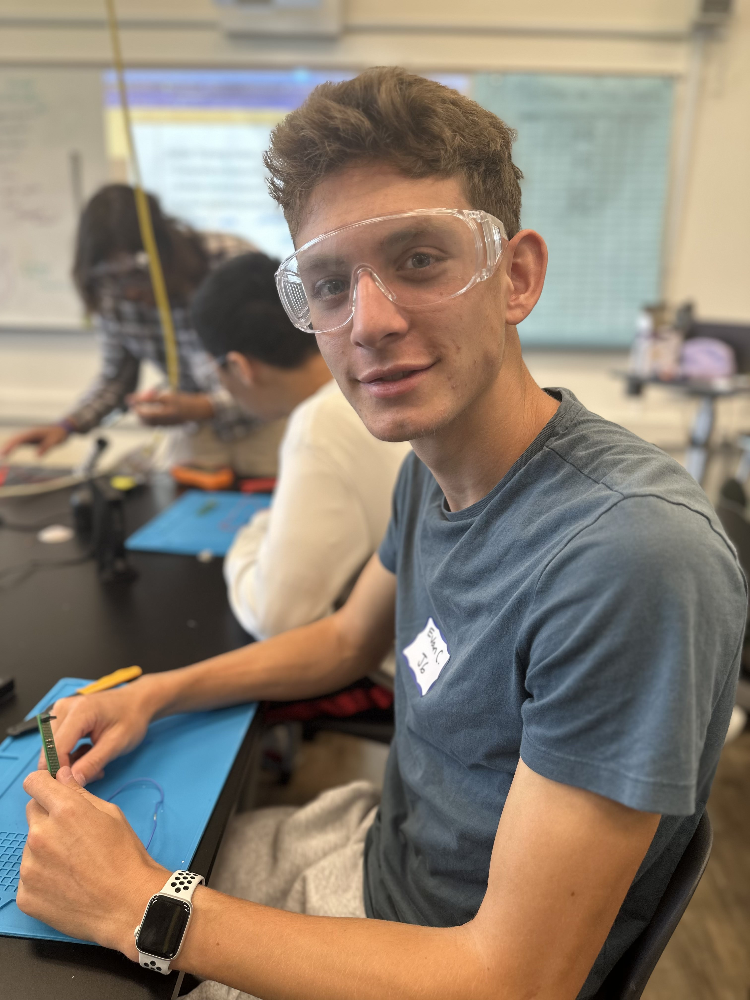
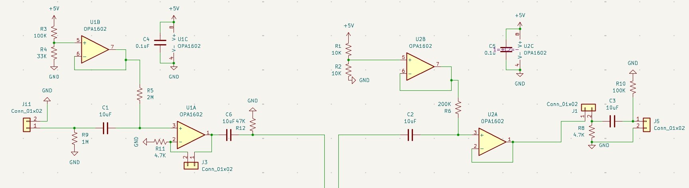

# Intensive Project: Audio Processor
Replace this text with a brief description (2-3 sentences) of your project. This description should draw the reader in and make them interested in what you've built. You can include what the biggest challenges, takeaways, and triumphs from completing the project were. As you complete your portfolio, remember your audience is less familiar than you are with all that your project entails!

You should comment out all portions of your portfolio that you have not completed yet, as well as any instructions:
```HTML 
<!--- This is an HTML comment in Markdown -->
<!--- Anything between these symbols will not render on the published site -->
```

| **Engineer** | **School** | **Area of Interest** | **Grade** |
|:--:|:--:|:--:|:--:|
| Evan C | Menlo Atherton | Robotics | Incoming Junior


  
# Final Milestone

**Don't forget to replace the text below with the embedding for your milestone video. Go to Youtube, click Share -> Embed, and copy and paste the code to replace what's below.**

<iframe width="560" height="315" src="https://www.youtube.com/embed/F7M7imOVGug" title="YouTube video player" frameborder="0" allow="accelerometer; autoplay; clipboard-write; encrypted-media; gyroscope; picture-in-picture; web-share" allowfullscreen></iframe>

For your final milestone, explain the outcome of your project. Key details to include are:
- What you've accomplished since your previous milestone
- What your biggest challenges and triumphs were at BSE
- A summary of key topics you learned about
- What you hope to learn in the future after everything you've learned at BSE


# Second Milestone

**Don't forget to replace the text below with the embedding for your milestone video. Go to Youtube, click Share -> Embed, and copy and paste the code to replace what's below.**

<iframe width="560" height="315" src="https://www.youtube.com/embed/y3VAmNlER5Y" title="YouTube video player" frameborder="0" allow="accelerometer; autoplay; clipboard-write; encrypted-media; gyroscope; picture-in-picture; web-share" allowfullscreen></iframe>

For your second milestone, explain what you've worked on since your previous milestone. You can highlight:
- Technical details of what you've accomplished and how they contribute to the final goal
- What has been surprising about the project so far
- Previous challenges you faced that you overcame
- What needs to be completed before your final milestone 

# First Milestone

<iframe width="560" height="315" src="https://www.youtube.com/embed/HKZY6D4AcYI" title="YouTube video player" frameborder="0" allow="accelerometer; autoplay; clipboard-write; encrypted-media; gyroscope; picture-in-picture; web-share" allowfullscreen></iframe>

For my first milestone, I setup up basic electronics and wrote some basic code to make sure all the hardware works. The setup tests my custom preamp PCB, the Teensy Audio Shield, and the Teensy microcontroller itself as well as the integration of them all. I've tested the Teensy's ability to read and understand an audio signal, as well as testing basic effects and processing. The biggest challenge in this milestone was integrating all my different components and debugging why the circuit wasn't working. Initially, I connected the Teensy to the Audio Shield incorrectly; I later realized that I needed to initialize the codec chip on the Audio Shield in my code; and the last issue I had was the design tool I was using didn't correctly set up my signal path.

After I fixed all the bugs, I realized that the circuit had a lot of noise, which was especially apparent when the signal was amplified. Moving forward, I need to find where the noise is coming from and implement a noise gate in software if necessary. After I do that, I can move forward with assembling the rest of the electronics.

# Schematics 

<p float="left">
  
   
</p>

# Code
Here's where you'll put your code. The syntax below places it into a block of code. Follow the guide [here]([url](https://www.markdownguide.org/extended-syntax/)) to learn how to customize it to your project needs. 

```c++
void setup() {
  // put your setup code here, to run once:
  Serial.begin(9600);
  Serial.println("Hello World!");
}

void loop() {
  // put your main code here, to run repeatedly:

}
```

# Bill of Materials
Here's where you'll list the parts in your project. To add more rows, just copy and paste the example rows below.
Don't forget to place the link of where to buy each component inside the quotation marks in the corresponding row after href =. Follow the guide [here]([url](https://www.markdownguide.org/extended-syntax/)) to learn how to customize this to your project needs. 

| **Part** | **Note** | **Price** | **Link** |
|:--:|:--:|:--:|:--:|
| Teensy 4.1 | Microcontroller | $31.50 | <a href="https://www.sparkfun.com/teensy-4-1.html"> Sparkfun </a> |
| Teensy Audio Shield | Audio input board | $9.80 | <a href="https://www.sparkfun.com/teensy-4-audio-shield-rev-d.html"> Sparkfun </a> |
| 6.35mm Audio Jacks | Connect cables | $9.99 | <a href="https://www.amazon.com/Treedix-Breakout-Pannel-6-35mm-Headphone/dp/B09Z2MQLHX"> Amazon </a> |
| Buttons/Switches | Control effects | $12.49 | <a href="https://www.amazon.com/Etopars-Guitar-Effects-Momentary-Button/dp/B076V2QYSJ"> Amazon </a> |
| Knobs | Control effects | $9.99 | <a href="https://www.amazon.com/EPLZON-Linear-Potentiometer-XH2-54-3-Connector/dp/B0D2991CBF"> Amazon </a> |
| 1.3" OLED | Screen | $10.98 | <a href="https://www.amazon.com/DIYmall-Serial-128X64-Display-Arduino/dp/B06XXTHLNW"> Amazon </a> |

# Other Resources/Examples
One of the best parts about Github is that you can view how other people set up their own work. Here are some past BSE portfolios that are awesome examples. You can view how they set up their portfolio, and you can view their index.md files to understand how they implemented different portfolio components.
- [Example 1](https://trashytuber.github.io/YimingJiaBlueStamp/)
- [Example 2](https://sviatil0.github.io/Sviatoslav_BSE/)
- [Example 3](https://arneshkumar.github.io/arneshbluestamp/)

To watch the BSE tutorial on how to create a portfolio, click here.

# Starter Project: Retro Arcade Console

<iframe width="560" height="315" src="https://www.youtube.com/embed/rUmHGdGd8cc?si=I4PNTilWzP2Y3OZt" title="YouTube video player" frameborder="0" allow="accelerometer; autoplay; clipboard-write; encrypted-media; gyroscope; picture-in-picture; web-share" allowfullscreen></iframe>

The Retro Arcade Console is a small handheld console that plays games like Tetris, Snake, and Space Invaders. It can be powered with batteries or plugged in to a USB port. It features an 8x16 LED matrix screen, 6 buttons, and a buzzer for playing sounds and music.

The project was fairly straightforward to build, consisting of a PCB with through-hole components that I soldered on. The most challenging part of the project was soldering smaller parts like the USB power jack, which had very small pins close together that were hard to solder without bridging/shorting pins. The main chip came pre-programmed, so the project was only assembly.

# Bill of Materials:
- **1** Piezo Buzzer
- **1** Electrolytic Capacitor
- **1** Micro USB Jack
- **1** Micro USB Power Cable
- **1** Latching Switch
- **1** Switch Cap
- **1** 3x7 Segment Digitron Display
- **1** Preprogrammed IC Chip
- **2** LED 8x8 Dot Matrices
- **6** Push Buttons
- **6** Button Caps
- **1** PCB
- **8** 3x5mm Screws
- **2** 3x8mm Screws
- **4** Double-pass Copper Standoffs
- **4** Single-head Hexagonal Standoffs
- **1** 3xAAA Battery Case
- **6** Acrylic Panels
